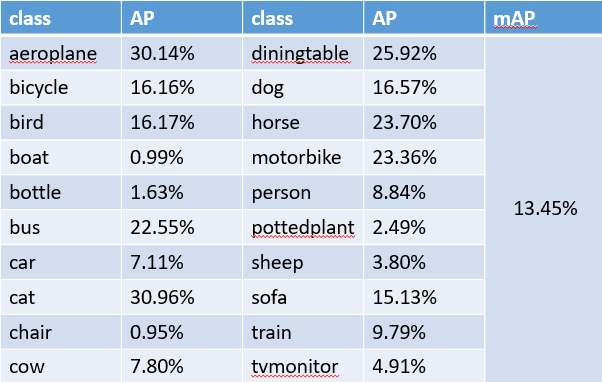

# 基于Pytorch的弱监督边框检测

## requirements
* Python3.6
* pytorch0.4.0-gpu(注：不支持pytorch1.1.0)

## Usage
1. 下载预训练的模型，放在demo\models路径中。

[[VGG16_ImageNet]](https://cloud.tsinghua.edu.cn/smart-link/66ab7d4c-7d6e-4e7b-8e1b-6d73a4c59878/)


2. 安装 SPN
    ```bash
    cd SPN/spnlib
    bash make.sh
    ```

3. 运行程序: 
    ```bash
    cd SPN.pytorch/demo
    bash runme.sh
    ```
    注：修改demo\experiment/demo_voc2007.py的--data参数为PascalVOC数据集的路径
4. 测试:
    

    step 1: 按照上述1-3的步骤训练，或者下载训练好的模型，放在demo\logs\voc2007路径下。下载链接如下：

    [[Our best model]](https://cloud.tsinghua.edu.cn/smart-link/ea661822-d290-4a43-adaa-2a55ce0badae/)

    step 2: 运行demo/test.py文件，生成预测的框

    step 3: MAP计算: 运行pascalvoc.py文件。


5. 结果：

    
